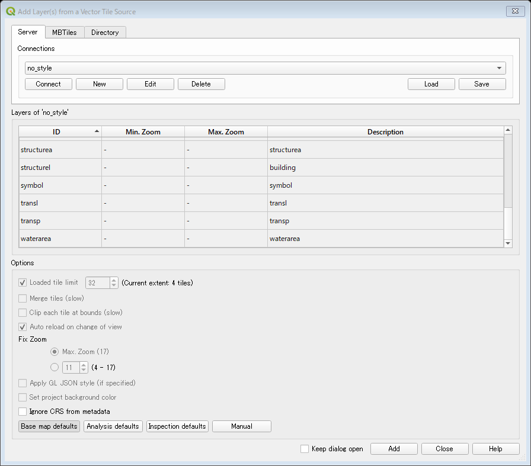
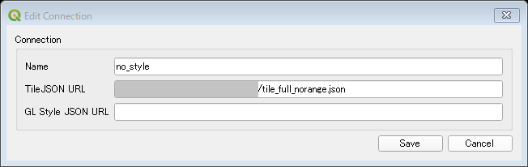
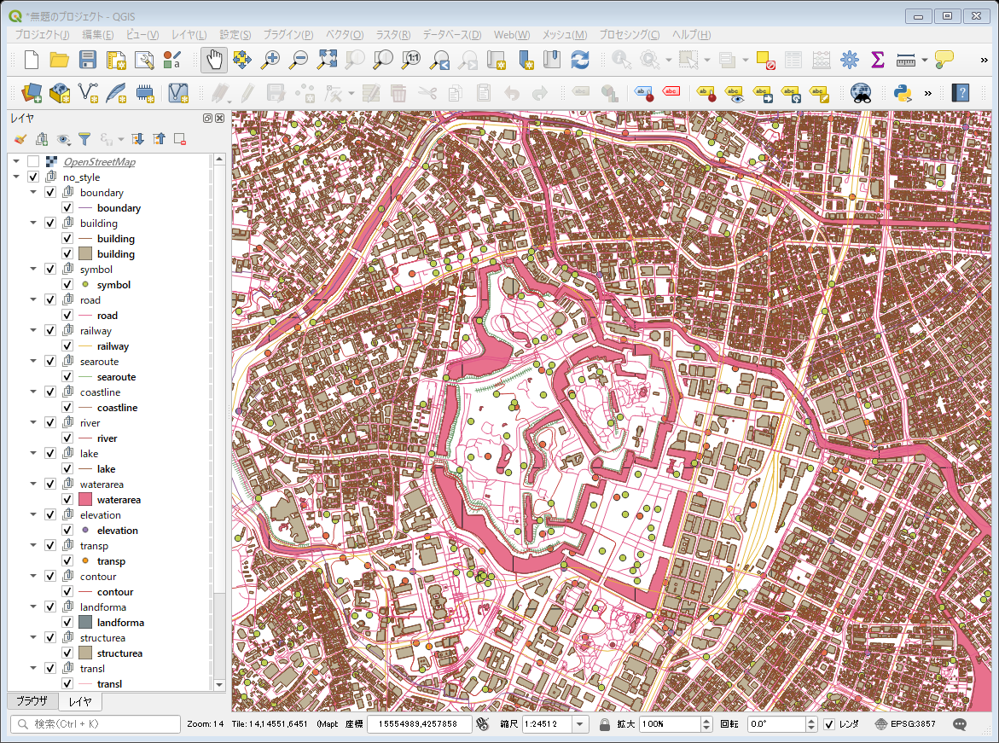
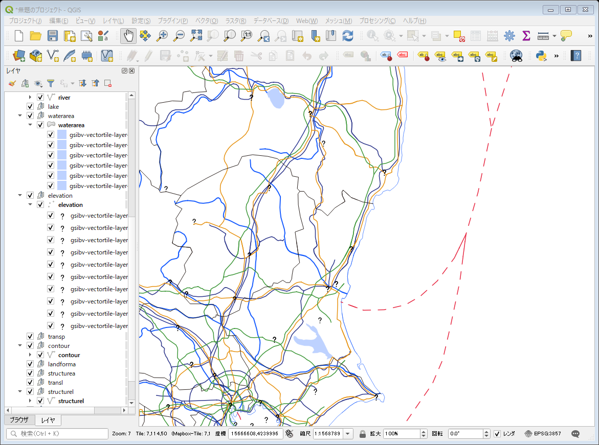
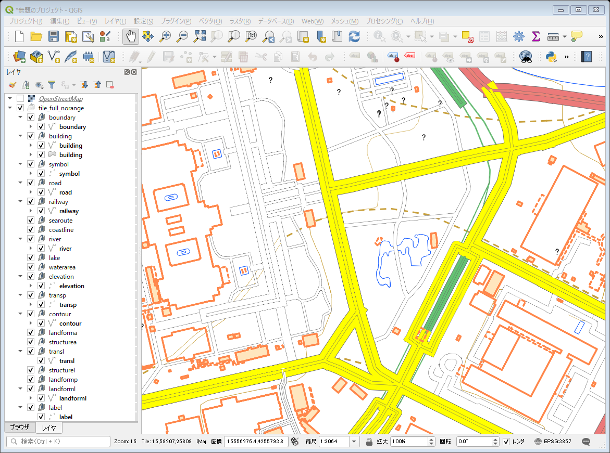

# QGISでMapbox Vector Tileを読み込む

## Vector Tiles Reader

QGISで[Mapbox Vector Tile](https://github.com/mapbox/vector-tile-spec)のベクトルタイルを読む際には、[Vector Tiles Reader](https://github.com/geometalab/Vector-Tiles-Reader-QGIS-Plugin/)を利用するのが一般的らしい。
今回は、[地理院地図Vector（仮称）提供実験](https://github.com/gsi-cyberjapan/gsimaps-vector-experiment)によるベクトルタイルを読み込んでみることにする。


ベクトルタイルのURLはこれ
`https://cyberjapandata.gsi.go.jp/xyz/{t}/{z}/{x}/{y}.{ext}`


### 参考
http://tmizu23.hatenablog.com/entry/20171209/1512787590


## 環境
- Windows 10
- QGIS 3.10.0


## 準備

### プラグインのインストール
QGISでは、プラグイン > プラグインの管理とインストール で、Vector Tiles Readerをインストールしておく。


### TileJSONの準備
Vector Tiles Readerでは、TileJSONというファイルが必要らしいので、これを作成する。
仕様は[こちらの通り](https://github.com/mapbox/tilejson-spec)だが、Mapbox Vector Tileの場合、仕様には書かれていない`vector_layers`の設定が必要らしい（書かれていないなんてことはないだろうから、見落としだと思う）。`vector_layers`の中は、何を書けばよいのかわからなかったが、試行錯誤の上、`id`に、ベクトルタイルの`source-layer`を書けばうまくいきそうだとわかった。


地理院地図Vector（仮称）提供実験のベクトルタイルに含まれる`source-layer`は、[地物コード及び表示ズームレベル一覧](https://maps.gsi.go.jp/help/pdf/vector/dataspec.pdf)にある通り。


これを参考に記述すると、以下のようになる。（もし、抜け漏れたレイヤがあったらごめんなさい。）


```
{
  "tilejson": "2.2.0",
  "tiles": ["https://cyberjapandata.gsi.go.jp/xyz/experimental_bvmap/{z}/{x}/{y}.pbf"],
  "name": "gsimaps_vector_fulltile",
  "format": "pbf",
  "attribution": "<a href=\"https://github.com/gsi-cyberjapan/gsimaps-vector-experiment\">地理院地図Vector（仮称）提供実験</a>",
  "maxzoom": 17,
  "minzoom": 4,
  "bounds": [-180, -85.0511, 180, 85.0511],
  "center": [139.770832,35.689835,14],
  "vector_layers": [
    {"id": "symbol", "description": "symbol"},
    {"id": "boundary", "description": "boundary"},
    {"id": "road", "description": "road"},
    {"id": "railway", "description": "railway"},
    {"id": "searoute", "description": "searoute"},
    {"id": "coastline", "description": "coastline"},
    {"id": "river", "description": "river"},
    {"id": "lake", "description": "lake"},
    {"id": "waterarea", "description": "waterarea"},
    {"id": "elevation", "description": "elevation"},
    {"id": "transp", "description": "transp"},
    {"id": "contour", "description": "contour" },
    {"id": "landforma", "description": "landforma"},
    {"id": "structurea", "description": "structurea"},
    {"id": "building", "description": "building"},
    {"id": "transl", "description": "transl"},
    {"id": "structurel", "description": "structurel"},
    {"id": "landformp", "description": "landformp"},
    {"id": "landforml", "description": "landforml"},
    {"id": "label", "description": "label"}
  ]
}
```


## Vector Tiles Readerでベクトルタイルを読み込む。
Vector Tiles Readerをインストールしてあれば、以下の手順で、ベクトルタイルを読み込むことができる。


ベクタ > Vector Tiles Reader > Add Vector Tile layers... 


これで、新しいウィンドウが開くので、Serverのタブを選択する。


:Vector Tiles Readerの設定画面。画像はすべて設定し終わって、あとはAddボタンを押すだけのところ

Connectionsというところで、Newというボタンを押すと、Create Connectionというウィンドウが出てくる。ここに、Connectionの名前（適当でよい）、TileJSON URLに先ほど作ったTileJSONのURLを入れる（別にWebサーバでホストしていなくても、ローカル環境のファイルパスを入れれば問題ないみたいです）。GL Style JSON URLは空白でも大丈夫（ここについては後述）。Saveボタンで保存。

もし、修正する場合は、Editボタンから、Edit Connectionウィンドウを開いて修正すればよい。操作方法は全く同じ。


:Edit Connectionウィンドウの設定例


次に、Connectボタンを押すと、TileJSONがうまく読まれていれば、真ん中の部分にTileJSONの`id`で設定したレイヤが表示される。これを全選択する。


下のOptionsの設定はとりあえず、Base map defaultsでいいと思う。


これで、右下のAddボタンを押すと、ベクトルタイルが読み込まれ、QGIS本体に表示される。QGISで扱う普通のレイヤと同じような感覚で、「レイヤ」パネルのプロパティやスタイルで調整が可能。


:地理院地図Vector（仮称）提供実験のベクトルタイルを読み込んだところ

## MapboxのStyle JSONを適用する

上では省いたが、GL Style JSON URLに[StyleJSON](https://docs.mapbox.com/mapbox-gl-js/style-spec/)を設定することで、スタイルを決めてあげることも可能。ただし、Mapbox Gl JSで利用しているStyle JSON（たとえば、[こちら](https://github.com/mghs15/map2/blob/master/README.md#%E4%BB%8A%E5%9B%9E%E3%81%9F%E3%82%81%E3%81%97%E3%81%AB%E4%BD%9C%E6%88%90%E3%81%97%E3%81%9F%E3%82%82%E3%81%AE)）をそのまま設定しようとしたらいろいろと不具合が生じた。このあたりの対策は未解決で、ただ単にデータを読み込むだけなら、GL Style JSON URLは未指定のままが良いかもしれない。


* StyleJSONのSprite設定がQGIS上の表示では反映されない。
* 道路の枠線がうまく表示できず、道路が2重に表示されてしまう。
* 注記（label）はうまく設定できない。（プロパティから「ラベル」を設定すれば表示できるが、表示されたりされなかったり挙動がつかめない。）
* 記号（symbol）もうまく設定できない。（プロパティから「シンポロジ」を設定すれば表示できる。）
* StyleJSONで行っているズームレベルごとの設定が本当に反映できているのか疑問。未検証であるが、もしこの仮説が正しいのであれば、TileJSONで細かい調整を行うことが必要かもしれない。



:StyleJSONのSprite設定がQGIS上の表示では反映されず、アイコンは「?」となってしまう。


:道路の枠線がうまく表示できず、道路が2重に表示されてしまう


### 躓いたところ

* TileJSONには、centerを設定できるが、QGISで読み込んだ時に必ずしもその位置になるわけでない。当たり前のようだが、位置をベクトルタイルの領域に合わせてあげることが必要。
* TileJSON、Style JSONは、UTF-8に設定しておかないと怒られる。


